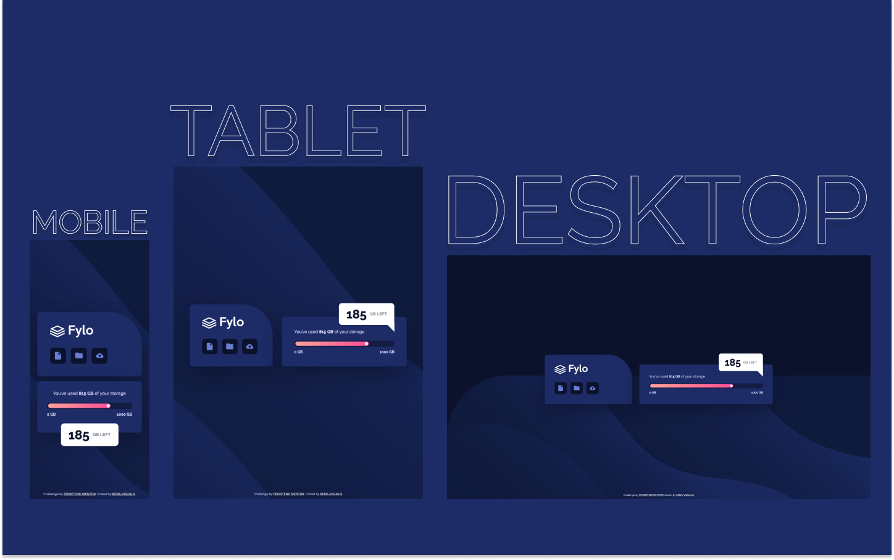

# Frontend Mentor - Fylo Data Storage Component Solution

This is a solution to the [Fylo Data Storage Component Challenge on Frontend Mentor](https://www.frontendmentor.io/challenges/fylo-data-storage-component-1dZPRbV5n).

## Table of contents

- [Overview](#overview)
  - [The challenge](#the-challenge)
  - [Screenshot](#screenshot)
  - [Links](#links)
- [My process](#my-process)
  - [Built with](#built-with)
  - [What I learned](#what-i-learned)
  - [Useful resources](#useful-resources)
- [Author](#author)

## Overview

### The challenge

Users should be able to:

- View the optimal layout for the site depending on their device's screen size

### Screenshot

### Links

- Live Site URL: [https://kens-visuals.github.io/fylo-data-storage-component/](https://kens-visuals.github.io/fylo-data-storage-component/)
- Solution URL: [https://www.frontendmentor.io/solutions/fylo-data-storage-component-with-css-animations-scss-and-bem-Jc1s4LmUs](https://www.frontendmentor.io/solutions/fylo-data-storage-component-with-css-animations-scss-and-bem-Jc1s4LmUs)

## My process

### Built with

- Semantic HTML5 markup
- SCSS custom properties
- CSS Flexbox
- CSS Grid
- CSS Animations
- Mobile-first workflow

### What I learned

Always loved this fun little components that are just there to practice all the skills you've got before (of course if this is not your first project, and you've been nailing some challenges for a while). For me, the main challenge with this small projects is to get them as close to the design as possible. And every time I get thrilled like the first time when my project looks really close to the design.

### Useful resources

Since I used a bit of animations, I decided to share a couple of resources.

- [cubic-bezier.com](https://cubic-bezier.com/#.17,.67,.83,.67)
- [easings.co](https://easings.co/)

## Author

- Frontend Mentor - [@kens-visuals](https://www.frontendmentor.io/profile/kens-visuals)
- Codewars - [@kens_visuals](https://www.codewars.com/users/kens_visuals)
- CodePen - [@kens-visuals](https://codepen.io/kens-visuals)
